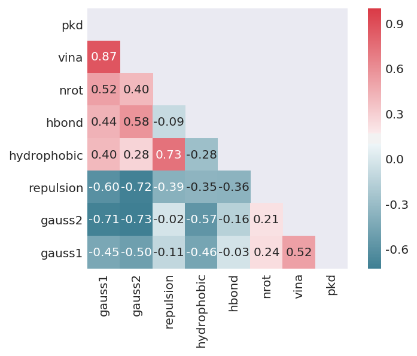
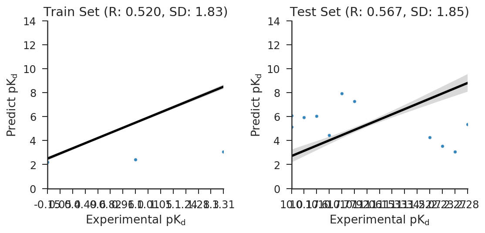
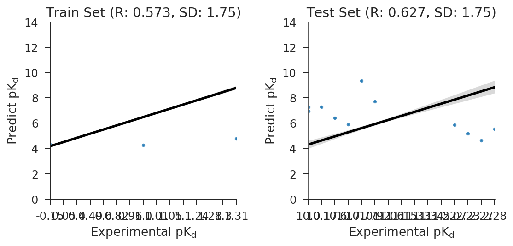
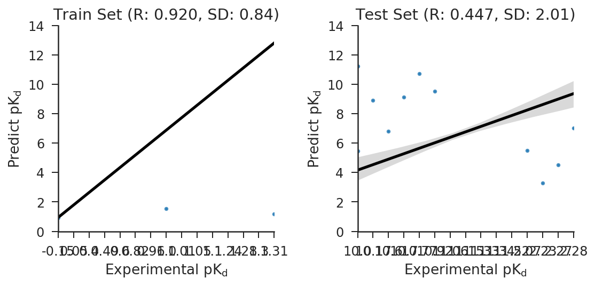
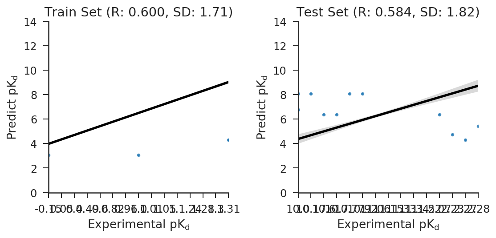
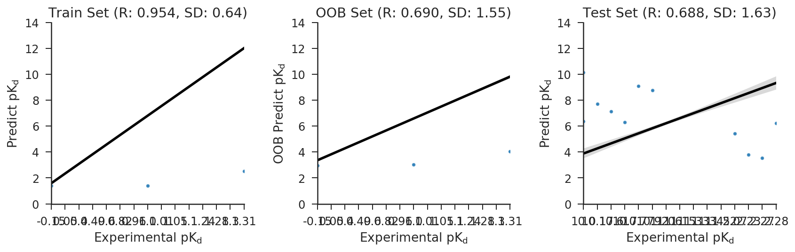
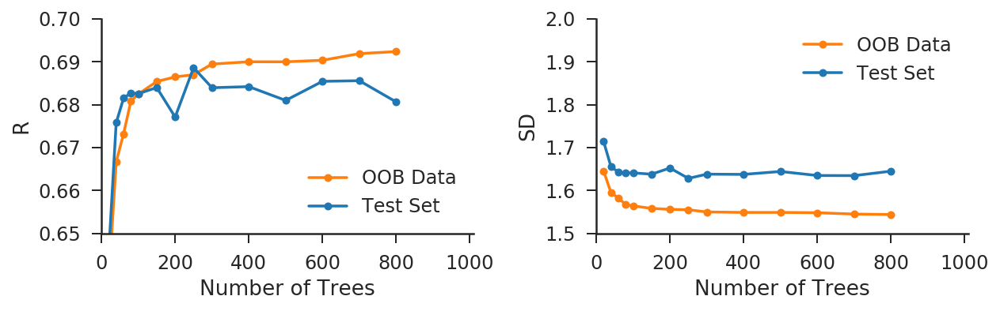
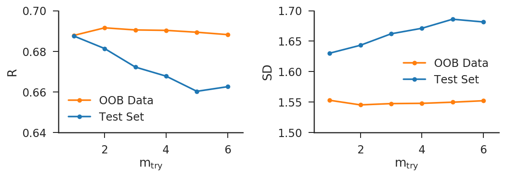

This is a brief tutorial regarding the use of Random Forest to develop new scoring function.
Needs to install Anaconda (https://www.continuum.io/downloads , python version 3.6)

#install package

conda install numpy matplotlib

conda install scipy scikit-learn seaborn

conda install -c conda-forge xgboost=0.6a2

conda install -c conda-forge pydotplus

#open the notebook in yourfolder

jupyter notebook


# Staring Tutorial


```python
%matplotlib inline
%config InlineBackend.figure_format = 'retina'

import numpy as np # linear algebra
import pandas as pd # data processing, CSV file I/O (e.g. pd.read_csv)

import matplotlib.pyplot as plt
import matplotlib.gridspec as gridspec
from mpl_toolkits.mplot3d import Axes3D
import seaborn as sns

color = sns.color_palette()
```


```python
# for models

from sklearn.linear_model import LinearRegression
from sklearn.tree import DecisionTreeRegressor, export_graphviz
from sklearn.ensemble import RandomForestRegressor
from sklearn.ensemble import GradientBoostingRegressor
from sklearn.model_selection import GridSearchCV, train_test_split, KFold
from sklearn.preprocessing import StandardScaler

from sklearn.ensemble.partial_dependence import plot_partial_dependence
from sklearn.ensemble.partial_dependence import partial_dependence

from scipy.stats.stats import pearsonr
```


```python
!pip install pydotplus
```

    Requirement already satisfied: pydotplus in /home/ma-user/anaconda3/envs/XGBoost-Sklearn/lib/python3.6/site-packages
    Requirement already satisfied: pyparsing>=2.0.1 in /home/ma-user/anaconda3/envs/XGBoost-Sklearn/lib/python3.6/site-packages (from pydotplus)
    You are using pip version 9.0.1, however version 20.1.1 is available.
    You should consider upgrading via the 'pip install --upgrade pip' command.


```python
from IPython.display import Image
import pydotplus
```


```python
# read in data 
traindf = pd.read_csv('data/PDBbind_vina6_train.csv')
testdf = pd.read_csv('data/PDBbind_vina6_test.csv')
```


```python
traindf.head(3)
```


<div>
<style scoped>
    .dataframe tbody tr th:only-of-type {
        vertical-align: middle;
    }

    .dataframe tbody tr th {
        vertical-align: top;
    }

    .dataframe thead th {
        text-align: right;
    }
</style>
<table border="1" class="dataframe">
  <thead>
    <tr style="text-align: right;">
      <th></th>
      <th>pdb</th>
      <th>gauss1</th>
      <th>gauss2</th>
      <th>repulsion</th>
      <th>hydrophobic</th>
      <th>hbond</th>
      <th>nrot</th>
      <th>vina</th>
      <th>pkd</th>
    </tr>
  </thead>
  <tbody>
    <tr>
      <th>0</th>
      <td>184l</td>
      <td>-33.662306</td>
      <td>-528.930696</td>
      <td>-0.405366</td>
      <td>-53.658468</td>
      <td>0.0</td>
      <td>2.0</td>
      <td>4.893687</td>
      <td>4.72</td>
    </tr>
    <tr>
      <th>1</th>
      <td>185l</td>
      <td>-34.230024</td>
      <td>-504.172620</td>
      <td>-0.712744</td>
      <td>-37.732352</td>
      <td>0.0</td>
      <td>0.0</td>
      <td>4.538638</td>
      <td>3.54</td>
    </tr>
    <tr>
      <th>2</th>
      <td>186l</td>
      <td>-35.048164</td>
      <td>-558.849670</td>
      <td>-0.927438</td>
      <td>-54.292838</td>
      <td>0.0</td>
      <td>3.0</td>
      <td>4.469118</td>
      <td>4.85</td>
    </tr>
  </tbody>
</table>
</div>


```python
traindf.describe()
```


<div>
<style scoped>
    .dataframe tbody tr th:only-of-type {
        vertical-align: middle;
    }

    .dataframe tbody tr th {
        vertical-align: top;
    }

    .dataframe thead th {
        text-align: right;
    }
</style>
<table border="1" class="dataframe">
  <thead>
    <tr style="text-align: right;">
      <th></th>
      <th>gauss1</th>
      <th>gauss2</th>
      <th>repulsion</th>
      <th>hydrophobic</th>
      <th>hbond</th>
      <th>nrot</th>
      <th>vina</th>
      <th>pkd</th>
    </tr>
  </thead>
  <tbody>
    <tr>
      <th>count</th>
      <td>3336.000000</td>
      <td>3336.000000</td>
      <td>3336.000000</td>
      <td>3336.000000</td>
      <td>3336.000000</td>
      <td>3336.000000</td>
      <td>3336.000000</td>
      <td>3336.000000</td>
    </tr>
    <tr>
      <th>mean</th>
      <td>-67.468406</td>
      <td>-969.036064</td>
      <td>-3.441709</td>
      <td>-22.470986</td>
      <td>-3.799166</td>
      <td>7.404227</td>
      <td>5.165168</td>
      <td>6.225225</td>
    </tr>
    <tr>
      <th>std</th>
      <td>26.703803</td>
      <td>410.251945</td>
      <td>1.917357</td>
      <td>20.377186</td>
      <td>2.562255</td>
      <td>5.702406</td>
      <td>1.764170</td>
      <td>2.139956</td>
    </tr>
    <tr>
      <th>min</th>
      <td>-218.597332</td>
      <td>-3082.383593</td>
      <td>-15.844859</td>
      <td>-131.225250</td>
      <td>-15.993253</td>
      <td>0.000000</td>
      <td>-4.335666</td>
      <td>-0.150000</td>
    </tr>
    <tr>
      <th>25%</th>
      <td>-85.800302</td>
      <td>-1217.174708</td>
      <td>-4.517567</td>
      <td>-35.601269</td>
      <td>-5.395351</td>
      <td>3.500000</td>
      <td>3.922683</td>
      <td>4.687500</td>
    </tr>
    <tr>
      <th>50%</th>
      <td>-64.198905</td>
      <td>-907.944196</td>
      <td>-3.119924</td>
      <td>-18.252762</td>
      <td>-3.450290</td>
      <td>6.000000</td>
      <td>5.124965</td>
      <td>6.345000</td>
    </tr>
    <tr>
      <th>75%</th>
      <td>-47.021020</td>
      <td>-664.470041</td>
      <td>-2.037401</td>
      <td>-4.633696</td>
      <td>-1.815735</td>
      <td>9.500000</td>
      <td>6.349995</td>
      <td>7.740000</td>
    </tr>
    <tr>
      <th>max</th>
      <td>-5.069520</td>
      <td>-96.617791</td>
      <td>-0.055892</td>
      <td>0.000000</td>
      <td>0.000000</td>
      <td>42.500000</td>
      <td>11.293774</td>
      <td>13.000000</td>
    </tr>
  </tbody>
</table>
</div>


```python
testdf.describe()
```


<div>
<style scoped>
    .dataframe tbody tr th:only-of-type {
        vertical-align: middle;
    }

    .dataframe tbody tr th {
        vertical-align: top;
    }

    .dataframe thead th {
        text-align: right;
    }
</style>
<table border="1" class="dataframe">
  <thead>
    <tr style="text-align: right;">
      <th></th>
      <th>gauss1</th>
      <th>gauss2</th>
      <th>repulsion</th>
      <th>hydrophobic</th>
      <th>hbond</th>
      <th>nrot</th>
      <th>vina</th>
      <th>pkd</th>
    </tr>
  </thead>
  <tbody>
    <tr>
      <th>count</th>
      <td>195.000000</td>
      <td>195.000000</td>
      <td>195.000000</td>
      <td>195.000000</td>
      <td>195.000000</td>
      <td>195.000000</td>
      <td>195.000000</td>
      <td>195.000000</td>
    </tr>
    <tr>
      <th>mean</th>
      <td>-67.708773</td>
      <td>-964.859079</td>
      <td>-3.469273</td>
      <td>-24.720016</td>
      <td>-3.858483</td>
      <td>6.720513</td>
      <td>5.449859</td>
      <td>6.295897</td>
    </tr>
    <tr>
      <th>std</th>
      <td>24.139514</td>
      <td>354.752395</td>
      <td>1.828057</td>
      <td>19.946025</td>
      <td>2.732448</td>
      <td>5.263186</td>
      <td>1.728477</td>
      <td>2.250904</td>
    </tr>
    <tr>
      <th>min</th>
      <td>-156.773527</td>
      <td>-2102.125535</td>
      <td>-10.619956</td>
      <td>-102.775730</td>
      <td>-15.529963</td>
      <td>0.000000</td>
      <td>0.502679</td>
      <td>2.070000</td>
    </tr>
    <tr>
      <th>25%</th>
      <td>-82.643054</td>
      <td>-1226.614619</td>
      <td>-4.461743</td>
      <td>-37.540748</td>
      <td>-5.747944</td>
      <td>3.500000</td>
      <td>4.184173</td>
      <td>4.600000</td>
    </tr>
    <tr>
      <th>50%</th>
      <td>-64.572027</td>
      <td>-923.139733</td>
      <td>-3.260678</td>
      <td>-20.784822</td>
      <td>-3.454474</td>
      <td>5.000000</td>
      <td>5.273505</td>
      <td>6.270000</td>
    </tr>
    <tr>
      <th>75%</th>
      <td>-49.590396</td>
      <td>-664.408352</td>
      <td>-2.150625</td>
      <td>-8.959760</td>
      <td>-1.714328</td>
      <td>8.250000</td>
      <td>6.597305</td>
      <td>7.980000</td>
    </tr>
    <tr>
      <th>max</th>
      <td>-22.711801</td>
      <td>-420.035793</td>
      <td>-0.162300</td>
      <td>0.000000</td>
      <td>0.000000</td>
      <td>34.000000</td>
      <td>11.819345</td>
      <td>11.520000</td>
    </tr>
  </tbody>
</table>
</div>


```python
testdf.head()
```


<div>
<style scoped>
    .dataframe tbody tr th:only-of-type {
        vertical-align: middle;
    }

    .dataframe tbody tr th {
        vertical-align: top;
    }

    .dataframe thead th {
        text-align: right;
    }
</style>
<table border="1" class="dataframe">
  <thead>
    <tr style="text-align: right;">
      <th></th>
      <th>pdb</th>
      <th>gauss1</th>
      <th>gauss2</th>
      <th>repulsion</th>
      <th>hydrophobic</th>
      <th>hbond</th>
      <th>nrot</th>
      <th>vina</th>
      <th>pkd</th>
    </tr>
  </thead>
  <tbody>
    <tr>
      <th>0</th>
      <td>10gs</td>
      <td>-82.076308</td>
      <td>-1008.198967</td>
      <td>-3.857677</td>
      <td>-25.970168</td>
      <td>-5.160107</td>
      <td>13.5</td>
      <td>4.929232</td>
      <td>6.40</td>
    </tr>
    <tr>
      <th>1</th>
      <td>1a30</td>
      <td>-62.847097</td>
      <td>-958.542740</td>
      <td>-3.455567</td>
      <td>-15.031663</td>
      <td>-2.636701</td>
      <td>12.5</td>
      <td>3.666491</td>
      <td>4.30</td>
    </tr>
    <tr>
      <th>2</th>
      <td>1bcu</td>
      <td>-45.249317</td>
      <td>-635.009529</td>
      <td>-0.466092</td>
      <td>-8.180374</td>
      <td>-0.548346</td>
      <td>0.5</td>
      <td>4.955308</td>
      <td>3.28</td>
    </tr>
    <tr>
      <th>3</th>
      <td>1e66</td>
      <td>-92.762719</td>
      <td>-986.928373</td>
      <td>-1.611327</td>
      <td>-65.450145</td>
      <td>0.000000</td>
      <td>1.5</td>
      <td>8.577114</td>
      <td>9.89</td>
    </tr>
    <tr>
      <th>4</th>
      <td>1f8b</td>
      <td>-53.149217</td>
      <td>-782.381801</td>
      <td>-4.072825</td>
      <td>-6.739578</td>
      <td>-4.855794</td>
      <td>7.0</td>
      <td>3.967290</td>
      <td>5.40</td>
    </tr>
  </tbody>
</table>
</div>


# Pairwise relationship between features and pKd


```python
sns.set_style("dark")

def plot_corr(predictors):
    predictors = predictors[:]
    mcorr = traindf[predictors].corr()
    mask = np.zeros_like(mcorr, dtype=np.bool)
    mask[np.triu_indices_from(mask)] = True
    cmap = sns.diverging_palette(220, 10, as_cmap=True)
    g = sns.heatmap(mcorr, mask=mask, cmap=cmap, square=True, annot=True, fmt='0.2f')
    g.set_xticklabels(predictors, rotation=90)
    g.set_yticklabels(reversed(predictors))
    plt.show()
    
plot_corr(['gauss1','gauss2','repulsion','hydrophobic','hbond','nrot','vina','pkd'])
```





```python
feats = ['gauss1','gauss2','repulsion','hydrophobic','hbond','nrot']
```


```python
trainX = traindf[['gauss1','gauss2','repulsion','hydrophobic','hbond','nrot']]
trainY = traindf[['pkd']]
testX = testdf[['gauss1','gauss2','repulsion','hydrophobic','hbond','nrot']]
testY = testdf[['pkd']]
```


```python
def getRSD(trainPredY, trainY, testPredY, testY):
    """
    Calculate the R and SD between predicated values and experimental values
    """
    
    lm = LinearRegression()
    lm.fit(trainPredY, trainY)
    trainR = lm.score(trainPredY, trainY)**0.5
    trainSD = np.sqrt(np.average((lm.predict(trainPredY) - trainY)**2))
    
    lm = LinearRegression()
    lm.fit(testPredY, testY)
    testR = lm.score(testPredY, testY)**0.5
    testSD = np.sqrt(np.average((lm.predict(testPredY) - testY)**2))
    print("Train R: %.3f, SD: %.2f; Test  R: %.3f, SD: %.2f"%(trainR, trainSD, testR, testSD))
    
    return trainR, trainSD, testR, testSD
```


```python
def plotpKd(trainPredY, trainY, testPredY, testY):
    sns.set_context("notebook", font_scale=1.2)
    sns.set_style("ticks")

    rsd = getRSD(trainPredY, trainY, testPredY, testY)
    plt.figure(figsize = (8,4))
    
    plt.subplot(121)
    sns.regplot(x = trainY, y = trainPredY.ravel(), color = 'k', scatter_kws = {'s':3, 'lw':2, 'color':color[0]})
    sns.despine()
    plt.xlabel(r'Experimental pK$_{\mathrm{d}}$')
    plt.ylabel(r'Predict pK$_{\mathrm{d}}$')
    plt.xlim(0,14)
    plt.ylim(0,14)
    plt.title('Train Set (R: %.3f, SD: %.2f)' %(rsd[0],rsd[1]))

    plt.subplot(122)
    sns.regplot(x = testY, y = testPredY.ravel(),color = 'k', scatter_kws = {'s':3, 'lw':2, 'color':color[0]})
    sns.despine()
    plt.xlabel(r'Experimental pK$_{\mathrm{d}}$')
    plt.ylabel(r'Predict pK$_{\mathrm{d}}$')
    plt.xlim(0,14)
    plt.ylim(0,14)
    plt.title('Test Set (R: %.3f, SD: %.2f)' %(rsd[2],rsd[3]))
    plt.tight_layout()

    plt.show()
```


```python
plotpKd(traindf[['vina']].values, trainY, testdf[['vina']].values, testY)
```

    Train R: 0.520, SD: 1.83; Test  R: 0.567, SD: 1.85





# Linear Regression


```python
rsd = getRSD(traindf[['vina']], trainY, testdf[['vina']], testY)
```

    Train R: 0.520, SD: 1.83; Test  R: 0.567, SD: 1.85


```python
# normalize the features for linear regression
scaler = StandardScaler()
scaler = scaler.fit(trainX)

trainXscale = scaler.transform(trainX)
testXscale = scaler.transform(testX)
```


```python
# Create linear regression object
lm = LinearRegression()
# Train the model using the training sets
lm.fit(trainXscale, trainY)
# predict on training set
trainPredY = lm.predict(trainXscale)
# predict on test set
testPredY = lm.predict(testXscale)
# get the R and SD
rsd = getRSD(trainPredY, trainY, testPredY, testY)
```

    Train R: 0.573, SD: 1.75; Test  R: 0.627, SD: 1.75


```python
plotpKd(trainPredY, trainY, testPredY, testY)
```

    Train R: 0.573, SD: 1.75; Test  R: 0.627, SD: 1.75





# Tree Regression


```python
tr = DecisionTreeRegressor( max_depth =20, min_samples_split =10)
tr.fit(trainX, trainY)
trainPredYtr = tr.predict(trainX)
testPredYtr = tr.predict(testX)

rsd = getRSD(trainPredYtr.reshape(-1,1), trainY, testPredYtr.reshape(-1,1), testY)
```

    Train R: 0.920, SD: 0.84; Test  R: 0.447, SD: 2.01


```python
plotpKd(trainPredYtr.reshape(-1,1), trainY, testPredYtr.reshape(-1,1), testY)
```

    Train R: 0.920, SD: 0.84; Test  R: 0.447, SD: 2.01





We can see that the above tree regression is significantly overfitted


```python
tr = DecisionTreeRegressor( max_depth =3)
tr.fit(trainX, trainY)
trainPredYtr = tr.predict(trainX)
testPredYtr = tr.predict(testX)

rsd = getRSD(trainPredYtr.reshape(-1,1), trainY, testPredYtr.reshape(-1,1), testY)
```

    Train R: 0.600, SD: 1.71; Test  R: 0.584, SD: 1.82


```python
plotpKd(trainPredYtr.reshape(-1,1), trainY, testPredYtr.reshape(-1,1), testY)
```

    Train R: 0.600, SD: 1.71; Test  R: 0.584, SD: 1.82





# Random Forest


```python
# model with 500 trees and mtry = 2, the min_sample to split is 5
rf = RandomForestRegressor( n_estimators = 500, max_features = 2, min_samples_split =5, oob_score = True)
# fit the model
rf.fit(trainX, trainY['pkd'].values)
# predict training set
trainPredYrf = rf.predict(trainX)
# predict test set
testPredYrf = rf.predict(testX)
# get oob prediction
oobPredYrf = rf.oob_prediction_
# get rsd
rsd1 = getRSD(trainPredYrf.reshape(-1,1), trainY, testPredYrf.reshape(-1,1), testY)
rsd2 = getRSD(oobPredYrf.reshape(-1,1), trainY, testPredYrf.reshape(-1,1), testY)
```

    Train R: 0.954, SD: 0.64; Test  R: 0.688, SD: 1.63
    Train R: 0.690, SD: 1.55; Test  R: 0.688, SD: 1.63


```python
def plotpKdoob(trainPredY, trainY, testPredY, testY, oobPredY, oobY):
    sns.set_context("notebook", font_scale=1.2)
    sns.set_style("ticks")

    rsd1 = getRSD(trainPredYrf.reshape(-1,1), trainY, testPredYrf.reshape(-1,1), testY)
    rsd2 = getRSD(oobPredYrf.reshape(-1,1), trainY, testPredYrf.reshape(-1,1), testY)
    
    plt.figure(figsize = (12,4))

    plt.subplot(131)
    sns.regplot(x = trainY, y = trainPredYrf, color = 'k', scatter_kws = {'s':3, 'lw':2, 'color':color[0]})
    plt.xlabel(r'Experimental pK$_{\mathrm{d}}$')
    plt.ylabel(r'Predict pK$_{\mathrm{d}}$')
    plt.xlim(0,14)
    plt.ylim(0,14)
    plt.title('Train Set (R: %.3f, SD: %.2f)' %(rsd1[0],rsd1[1]))

    plt.subplot(132)
    sns.regplot(x = trainY, y = oobPredYrf,color = 'k', scatter_kws = {'s':3, 'lw':2, 'color':color[0]})
    plt.xlabel(r'Experimental pK$_{\mathrm{d}}$')
    plt.ylabel(r'OOB Predict pK$_{\mathrm{d}}$')
    plt.xlim(0,14)
    plt.ylim(0,14)
    plt.title('OOB Set (R: %.3f, SD: %.2f)' %(rsd2[0],rsd2[1]))

    plt.subplot(133)
    sns.regplot(x = testY, y = testPredYrf,color = 'k', scatter_kws = {'s':3, 'lw':2, 'color':color[0]})
    plt.xlabel(r'Experimental pK$_{\mathrm{d}}$')
    plt.ylabel(r'Predict pK$_{\mathrm{d}}$')
    plt.xlim(0,14)
    plt.ylim(0,14)
    plt.title('Test Set (R: %.3f, SD: %.2f)' %(rsd1[2],rsd1[3]))

    sns.despine()
    plt.tight_layout()
    plt.savefig('data/RF_OOB.pdf')
    plt.show()
```


```python
plotpKdoob(trainPredYrf.reshape(-1,1), trainY, testPredYrf.reshape(-1,1), testY,oobPredYrf.reshape(-1,1), trainY )
```

    Train R: 0.954, SD: 0.64; Test  R: 0.688, SD: 1.63
    Train R: 0.690, SD: 1.55; Test  R: 0.688, SD: 1.63





# Feature Importance (Gini)


```python
imps = rf.feature_importances_
indices = np.argsort(imps)[::-1]
for nm, imp in zip(trainX.columns[indices], imps[indices]):
    print("%16s : %2d %%" %(nm, int(imp*100)))
```

              gauss2 : 25 %
         hydrophobic : 23 %
              gauss1 : 18 %
               hbond : 11 %
           repulsion : 10 %
                nrot : 10 %


```python
fig, ax = plt.subplots(figsize = (5,4))
rects1 = ax.bar(range(6), imps[indices]*100, width = 0.7, align='center', color = color[1])
plt.xticks(range(6), trainX.columns[indices],  rotation = 30)
plt.ylabel('Normalized Gini')
sns.despine()
plt.tight_layout()
plt.savefig('data/RF_importance.pdf')
plt.show()
```


# Parameters: number of trees and mtry


```python
rfrsd = []
ntree = [20,40,60,80,100,150,200,250,300,400,500,600,700,800]
for i in ntree:
    rf = RandomForestRegressor( n_estimators = i, max_features = 2, min_samples_split =5, oob_score = True)
    rf.fit(trainX, trainY['pkd'].values)
    trainPredYrf = rf.predict(trainX)
    testPredYrf = rf.predict(testX)
    oobPredYrf = rf.oob_prediction_
    print('ntree:',i)
    rsd1 = getRSD(trainPredYrf.reshape(-1,1), trainY, testPredYrf.reshape(-1,1), testY)
    rsd2 = getRSD(oobPredYrf.reshape(-1,1), trainY, testPredYrf.reshape(-1,1), testY)
    rfrsd.append([rsd1[0], rsd1[1], rsd2[0], rsd2[1], rsd1[2], rsd1[3] ])
```

    ntree: 20
    Train R: 0.943, SD: 0.71; Test  R: 0.646, SD: 1.71
    Train R: 0.639, SD: 1.64; Test  R: 0.646, SD: 1.71
    ntree: 40
    Train R: 0.949, SD: 0.68; Test  R: 0.676, SD: 1.65
    Train R: 0.667, SD: 1.59; Test  R: 0.676, SD: 1.65
    ntree: 60
    Train R: 0.951, SD: 0.66; Test  R: 0.681, SD: 1.64
    Train R: 0.673, SD: 1.58; Test  R: 0.681, SD: 1.64
    ntree: 80
    Train R: 0.952, SD: 0.66; Test  R: 0.683, SD: 1.64
    Train R: 0.681, SD: 1.57; Test  R: 0.683, SD: 1.64
    ntree: 100
    Train R: 0.953, SD: 0.65; Test  R: 0.683, SD: 1.64
    Train R: 0.682, SD: 1.56; Test  R: 0.683, SD: 1.64
    ntree: 150
    Train R: 0.953, SD: 0.65; Test  R: 0.684, SD: 1.64
    Train R: 0.685, SD: 1.56; Test  R: 0.684, SD: 1.64
    ntree: 200
    Train R: 0.954, SD: 0.64; Test  R: 0.677, SD: 1.65
    Train R: 0.686, SD: 1.56; Test  R: 0.677, SD: 1.65
    ntree: 250
    Train R: 0.954, SD: 0.64; Test  R: 0.689, SD: 1.63
    Train R: 0.687, SD: 1.55; Test  R: 0.689, SD: 1.63
    ntree: 300
    Train R: 0.954, SD: 0.64; Test  R: 0.684, SD: 1.64
    Train R: 0.689, SD: 1.55; Test  R: 0.684, SD: 1.64
    ntree: 400
    Train R: 0.954, SD: 0.64; Test  R: 0.684, SD: 1.64
    Train R: 0.690, SD: 1.55; Test  R: 0.684, SD: 1.64
    ntree: 500
    Train R: 0.954, SD: 0.64; Test  R: 0.681, SD: 1.64
    Train R: 0.690, SD: 1.55; Test  R: 0.681, SD: 1.64
    ntree: 600
    Train R: 0.954, SD: 0.64; Test  R: 0.685, SD: 1.63
    Train R: 0.690, SD: 1.55; Test  R: 0.685, SD: 1.63
    ntree: 700
    Train R: 0.955, SD: 0.64; Test  R: 0.686, SD: 1.63
    Train R: 0.692, SD: 1.54; Test  R: 0.686, SD: 1.63
    ntree: 800
    Train R: 0.955, SD: 0.64; Test  R: 0.681, SD: 1.64
    Train R: 0.692, SD: 1.54; Test  R: 0.681, SD: 1.64


```python
rfrsd = np.array(rfrsd)
plt.figure(figsize = (9,3))

plt.subplot(121)
#plt.plot(ntree, rfrsd[:,0], 'o-', color = color[2], ms = 5, label = 'Training Set')
plt.plot(ntree, rfrsd[:,2], 'o-',color = color[1], ms = 5, label = 'OOB Data')
plt.plot(ntree, rfrsd[:,4], 'o-',color = color[0], ms = 5, label = 'Test Set')
plt.ylabel('R')
plt.xlabel('Number of Trees')
plt.ylim(0.65,0.7)
plt.xlim(0,1010)
plt.legend(loc = 'best')

plt.subplot(122)
#plt.plot(ntree, rfrsd[:,1], 'ro-', color = color[2], ms = 5, label = 'Training Set')
plt.plot(ntree, rfrsd[:,3], 'o-',color = color[1], ms = 5, label = 'OOB Data')
plt.plot(ntree, rfrsd[:,5], 'o-',color = color[0], ms = 5, label = 'Test Set')
plt.ylabel('SD')
plt.xlabel('Number of Trees')
plt.ylim(1.5,2)
plt.xlim(0,1010)
plt.legend(loc = 1)

sns.despine()
plt.tight_layout()
plt.savefig('data/RF_NTrees.pdf')
plt.show()
```





```python
rfrsd = []
mtry = [1,2,3,4,5,6]
for i in mtry:
    rf = RandomForestRegressor( n_estimators = 500, max_features = i, min_samples_split =5, oob_score = True)
    rf.fit(trainX, trainY['pkd'].values)
    trainPredYrf = rf.predict(trainX)
    testPredYrf = rf.predict(testX)
    oobPredYrf = rf.oob_prediction_
    print('mtry:',i)
    rsd1 = getRSD(trainPredYrf.reshape(-1,1), trainY, testPredYrf.reshape(-1,1), testY)
    rsd2 = getRSD(oobPredYrf.reshape(-1,1), trainY, testPredYrf.reshape(-1,1), testY)
    rfrsd.append([rsd1[0], rsd1[1], rsd2[0], rsd2[1], rsd1[2], rsd1[3] ])
```

    mtry: 1
    Train R: 0.946, SD: 0.69; Test  R: 0.688, SD: 1.63
    Train R: 0.688, SD: 1.55; Test  R: 0.688, SD: 1.63
    mtry: 2
    Train R: 0.955, SD: 0.64; Test  R: 0.681, SD: 1.64
    Train R: 0.692, SD: 1.55; Test  R: 0.681, SD: 1.64
    mtry: 3
    Train R: 0.958, SD: 0.61; Test  R: 0.672, SD: 1.66
    Train R: 0.691, SD: 1.55; Test  R: 0.672, SD: 1.66
    mtry: 4
    Train R: 0.959, SD: 0.61; Test  R: 0.668, SD: 1.67
    Train R: 0.690, SD: 1.55; Test  R: 0.668, SD: 1.67
    mtry: 5
    Train R: 0.960, SD: 0.60; Test  R: 0.660, SD: 1.69
    Train R: 0.689, SD: 1.55; Test  R: 0.660, SD: 1.69
    mtry: 6
    Train R: 0.960, SD: 0.60; Test  R: 0.663, SD: 1.68
    Train R: 0.688, SD: 1.55; Test  R: 0.663, SD: 1.68


```python
rfrsd = np.array(rfrsd)

plt.figure(figsize = (8,3))

plt.subplot(121)
#plt.plot(ntree, rfrsd[:,0], 'o-',color = color[2], ms = 5, label = 'Training Set')
plt.plot(mtry, rfrsd[:,2], 'o-',color = color[1], ms = 5, label = 'OOB Data')
plt.plot(mtry, rfrsd[:,4], 'o-',color = color[0], ms = 5, label = 'Test Set')
plt.ylabel('R')
plt.xlabel('m$_{\mathrm{try}}$')
plt.ylim(0.64,0.7)
plt.xlim(0.5,6.5)
plt.legend(loc = 'best')

plt.subplot(122)

#plt.plot(ntree, rfrsd[:,1], 'o-',color = color[2], ms = 5, label = 'Training Set')
plt.plot(mtry, rfrsd[:,3], 'o-',color = color[1], ms = 5, label = 'OOB Data')
plt.plot(mtry, rfrsd[:,5], 'o-',color = color[0], ms = 5, label = 'Test Set')
plt.ylabel('SD')
plt.xlabel('m$_{\mathrm{try}}$')
plt.ylim(1.5,1.7)
plt.xlim(0.5,6.5)
plt.xticks()
plt.legend(loc = 'best')

sns.despine()
plt.tight_layout()
plt.savefig('data/RF_mtry.pdf')

plt.show()
```




